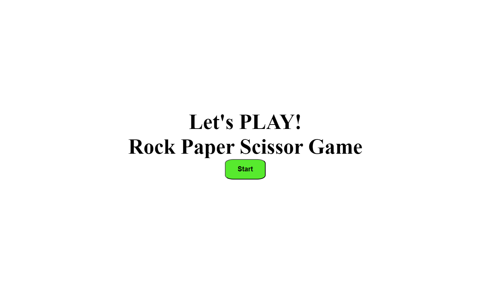
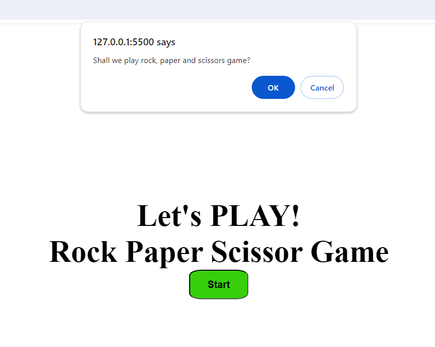
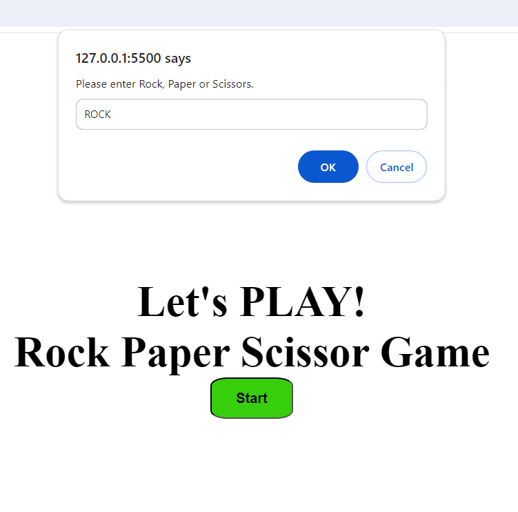
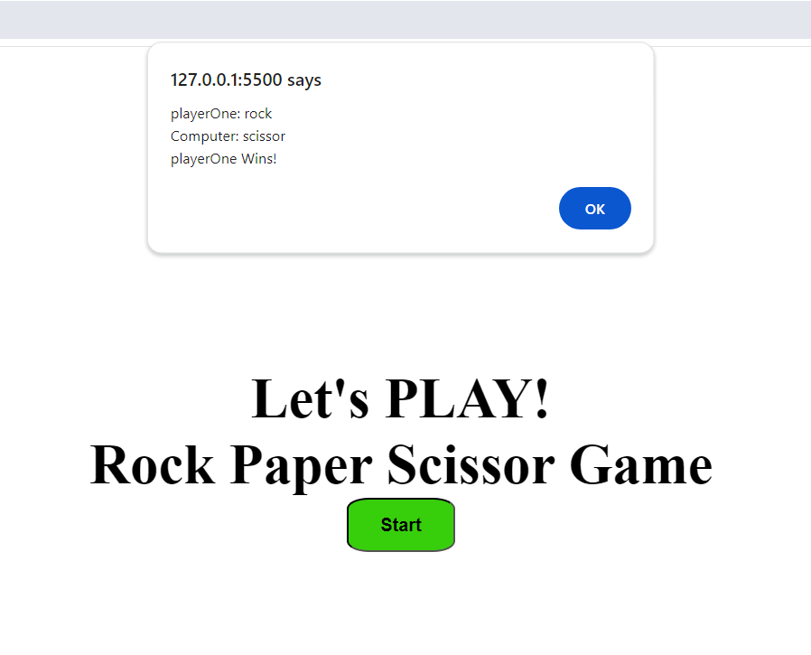

# Interactive Game using JavaScript

A simple interactive project to play the Rock, Paper, Scissors game.
Using a JavaScript alert box, user input is taken and compared with the computer input to determine the winner.

## How to start

Just open index.html file in your browser.

## Screenshots

